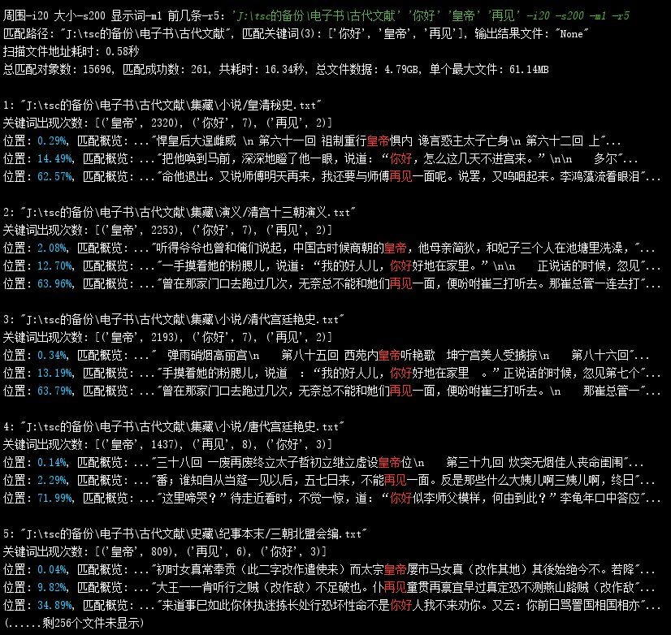

# 介绍
基于AC自动机的全文件夹文本搜索。可以快速搜索一个文件夹内的所有文本文件，并同时搜索多个词返回相关结果。
# 依赖包
pip install pyahocorasick
# 例子
- 下图表示在文件夹'J:\\...'内同时搜索3个关键词（同时包含所有关键词的文件），显示预览关键词的周围20个字符，最大搜索200MB的文件，显示第一个词出现的位置，显示前5条搜索结果。
- 不考虑硬盘瓶颈，这个例子单进程有300MB/S的搜索速度。可以再加一个路径输出所有结果。可以增加后缀名名单控制搜索文件的类型。
